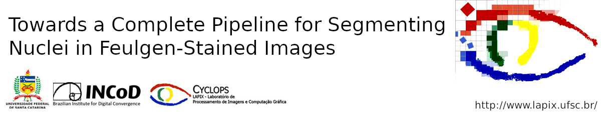
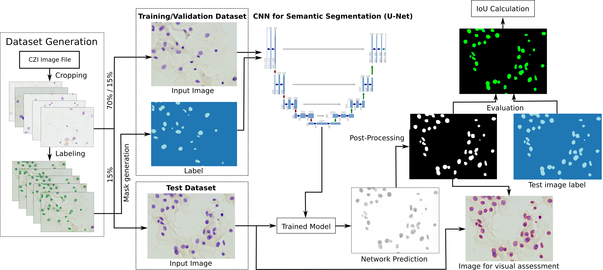

This is the implementation of the methodology and neural network used in our paper <a href="url">Towards a Complete Pipeline for Segmenting Nuclei in Feulgen-Stained Images</a>.

<h1>Introduction</h1>
  
Cervical cancer is the second most common cancer type in women around the world. In some countries, due to non-existent or inadequate screening, it is often detected at late stages, making standard treatment options often absent or unaffordable. It is a deadly disease that could benefit from early detection approaches. It is usually done by cytological exams which consist of visually inspecting the nuclei searching for morphological alteration. Since it is done by humans, naturally, some subjectivity is introduced. Computational methods could be used to reduce this, where the first stage of the process would be the nuclei segmentation. Here, we present a complete pipeline for the segmentation of nuclei in Feulgen-stained images using Convolutional Neural Networks.We achieved an overall IoU of 0.78, showing the affordability of the approach of nuclei segmentation on Feulgen-stained images.

<h1>Process overview</h1>

The figure below shows an overview of the entire process.

The first step consists in getting the image file of the scanned slide and submit it to the corresponding <a href="https://www.zeiss.com/microscopy/int/products/microscope-software/zen-lite.html">software</a> to generate the image patches (cropping process) that will be used to train the network. The software generates images of 1200x1600 pixels. Training the network for semantic segmentation is the second step, where we used the <a href="https://www.fast.ai/">fast.ai</a> framework. The post-processing step consists in using image processing methods to improve the outcome of the network. The last step is the evaluation of the results, which was done in post-processed images using the IoU metric.

<h2>Data</h2>
The directory tree should be organized as follows:
  <b>Dataset</b> (root)  
├── images  
│&nbsp;&nbsp;&nbsp;&nbsp;&nbsp;└── train  
│&nbsp;&nbsp;&nbsp;&nbsp;&nbsp;&nbsp;&nbsp;&nbsp;&nbsp;&nbsp;&nbsp;&nbsp;&nbsp;├── 1.png  
│&nbsp;&nbsp;&nbsp;&nbsp;&nbsp;&nbsp;&nbsp;&nbsp;&nbsp;&nbsp;&nbsp;&nbsp;&nbsp;├── 2.png   
│&nbsp;&nbsp;&nbsp;&nbsp;&nbsp;&nbsp;&nbsp;&nbsp;&nbsp;&nbsp;&nbsp;&nbsp;&nbsp;├── <...>  
│&nbsp;&nbsp;&nbsp;&nbsp;&nbsp;&nbsp;&nbsp;&nbsp;&nbsp;&nbsp;&nbsp;&nbsp;&nbsp;└── image_m.png  
│&nbsp;&nbsp;&nbsp;&nbsp;&nbsp;└── val  
│&nbsp;&nbsp;&nbsp;&nbsp;&nbsp;&nbsp;&nbsp;&nbsp;&nbsp;&nbsp;&nbsp;&nbsp;&nbsp;├── image_m+1.png  
│&nbsp;&nbsp;&nbsp;&nbsp;&nbsp;&nbsp;&nbsp;&nbsp;&nbsp;&nbsp;&nbsp;&nbsp;&nbsp;├── image_m+2.png  
│&nbsp;&nbsp;&nbsp;&nbsp;&nbsp;&nbsp;&nbsp;&nbsp;&nbsp;&nbsp;&nbsp;&nbsp;&nbsp;├── <...>  
│&nbsp;&nbsp;&nbsp;&nbsp;&nbsp;&nbsp;&nbsp;&nbsp;&nbsp;&nbsp;&nbsp;&nbsp;&nbsp;└── image_n.png  
│&nbsp;&nbsp;&nbsp;&nbsp;&nbsp;└── test  
│&nbsp;&nbsp;&nbsp;&nbsp;&nbsp;&nbsp;&nbsp;&nbsp;&nbsp;&nbsp;&nbsp;&nbsp;&nbsp;├── image_n+1.png  
│&nbsp;&nbsp;&nbsp;&nbsp;&nbsp;&nbsp;&nbsp;&nbsp;&nbsp;&nbsp;&nbsp;&nbsp;&nbsp;├── image_n+2.png  
│&nbsp;&nbsp;&nbsp;&nbsp;&nbsp;&nbsp;&nbsp;&nbsp;&nbsp;&nbsp;&nbsp;&nbsp;&nbsp;└── <...>  
└── labels  
&nbsp;&nbsp;&nbsp;&nbsp;&nbsp;├── 1.png  
&nbsp;&nbsp;&nbsp;&nbsp;&nbsp;├── 2.png  
&nbsp;&nbsp;&nbsp;&nbsp;&nbsp;├── <...>  
&nbsp;&nbsp;&nbsp;&nbsp;&nbsp;├── image_m.png  
&nbsp;&nbsp;&nbsp;&nbsp;&nbsp;├── <...>  
&nbsp;&nbsp;&nbsp;&nbsp;&nbsp;├── image_n.png  
&nbsp;&nbsp;&nbsp;&nbsp;&nbsp;└── <...>  

 You can use the "codes.txt" file present in this repository. It just contains the classes that we want to train. The mask must have the pixel values exact as it is in the "codes" file. For example, in this application, we want to segment the images in "Background" and "Nuclei" classes. So, that is the order that appears on "codes" file. The ground truth should be an image where the background pixels values are zero (In Python notation - <code>ground_truth[x, y, :] = (0, 0, 0)</code>) and the Nuclei pixels are 1 (<code>ground_truth[x, y, :] = (1, 1, 1)</code>). Different from that, the fast.ai will raise an exception.

<h1>Post-processing and Evaluation</h1>
On this step, we can use the "post-processing-and-evaluation.py". It takes as input three images: the input image, the network output, and the ground truth. It will apply the post-processing step and calculate the IoU for the image.

Unfortunately, for legal reasons (patient data), we cannot share the data and the pre-trained model. For further information, refer to: <b>the link will be posted once the paper is publicly available.</b>
