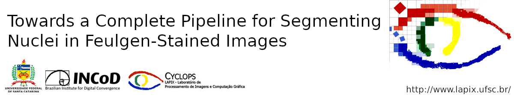
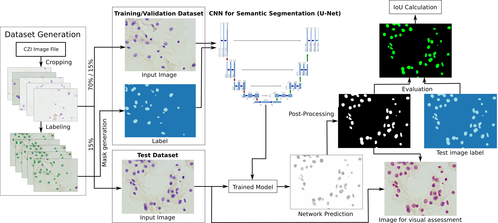

This is the implementation of the neural network used in our paper <a href="url">Towards a Complete Pipeline for Segmenting Nuclei in Feulgen-Stained Images</a>.

<h1>Introduction</h1>
  
Cervical cancer is the second most common cancer type in women around the world. In some countries, due to non-existent or inadequate screening, it is often detected at late stages, making standard treatment options often absent or unaffordable. It is a deadly disease that could benefit from early detection approaches. It is usually done by cytological exams which consist of visually inspecting the nuclei searching for morphological alteration. Since it is done by humans, naturally, some subjectivity is introduced. Computational methods could be used to reduce this, where the first stage of the process would be the nuclei segmentation. Here, we present a complete pipeline for the segmentation of nuclei in Feulgen-stained images using Convolutional Neural Networks.We achieved an overall IoU of 0.78, showing the affordability of the approach of nuclei segmentation on Feulgen-stained images.

<h1>Process overview</h1>

The Figure below shows an overview of the entire process

The first step consists in getting the image file of the scanned slide and submit it to the corresponding <a href="https://www.zeiss.com/microscopy/int/products/microscope-software/zen-lite.html">software</a> to generate the image patches (cropping process) that will be used to train the network. The software generate images of 1200x1600 pixels. Training the network (training.ipynb) for semantic segmentation is the second step, where we used the <a href="https://www.fast.ai/">fast.ai</a> framework. The post-processing step (post-processing.py) consists in using image processing methods to improve the outcome of the network. The last step is the evaluation (evaluation.py) of the results, which was done in post-processed images using the \ac{IoU} metric.

Unfortunately, for legal reasons (patient data), we cannot share the data and the pre-treined model. For further information, refer to:
